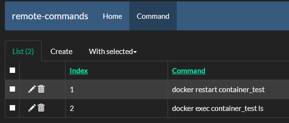

# remote-commands

[](https://www.python.org/)
[](https://flask.palletsprojects.com/en/2.0.x/)


## Descrição

Este app sobe um pequeno servidor Flask na sua máquina, e fica ouvindo por requisições vindas da rede local.

Essas requisições podem ativar algum atalho de teclado na sua máquina, ou executar algum comando shell previamente cadastrado.

Eu utilizo este app em conjunto com o app [HTTP Request Shortcuts](https://play.google.com/store/apps/details?id=ch.rmy.android.http_shortcuts&hl=en_US&gl=US) instalado em um celular. A partir dele envio as requests, e o celular funciona como um "controle remoto" que executa comandos no meu PC. Com isso eu economizo alguns alt+TABs e agilizo alguns testes onde preciso rodar o mesmo comando repetidas vezes no shell.

## Setup

- Clone o repositório
- Instale as dependência utilizando o `pipenv`
```sh
pipenv install
```
- Inicie o app com o comando
```sh
pipenv run python server/main.py
```
ou
```
./run.sh
```

## Cadastrando comandos

Em seu navegador, acesse `http://localhost:5000/admin` para ir a área de cadastro de comandos.



Cadastre quantos comandos quiser.

## Executando

### Executando atalhos

Para executar um atalho, envie uma requisição `POST` com o seguinte body JSON, a partir de qualquer dispositivo de sua rede local para:
- `http://<IP_da_sua_máquina>/shortcut`
```json
{
    "command": "<nome_do_atalho>"
}
```

### Executando comandos

Para executar os comandos, envie uma requisição `GET` de qualquer dispositivo de sua rede local para:
- `http://<IP_da_sua_máquina>/command/<index_do_comando>`
  - O `index_do_comando` aqui  o mesmo número que você cadastrou na área de **admin**

## O que eu usei

Este projetinho utiliza os seguintes frameworks e packages para fazer sua magia:
- **flask**: Micro-framework utilizado para fazer o servidor.
- **keyboard**: Lib utilizada para disparar atalhos de teclado na máquina.
- **flask-admin**: Lib que fornece pronta uma área de admin para as Models do app.
- **python-decouple**: Para pegar variáveis de ambiente.
- **peewee**: ORM que manipula o banco (que neste caso é um simples sqlite).
- **wtf-peewee**: Dependência necessária para o flask-admin fazer seus paranauês.
